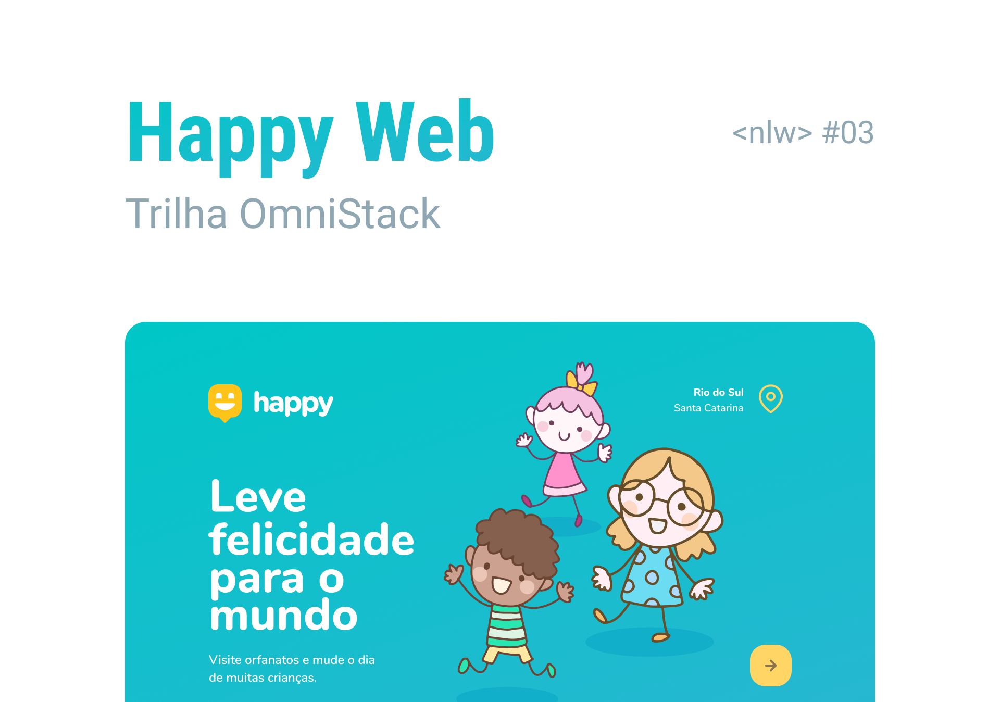
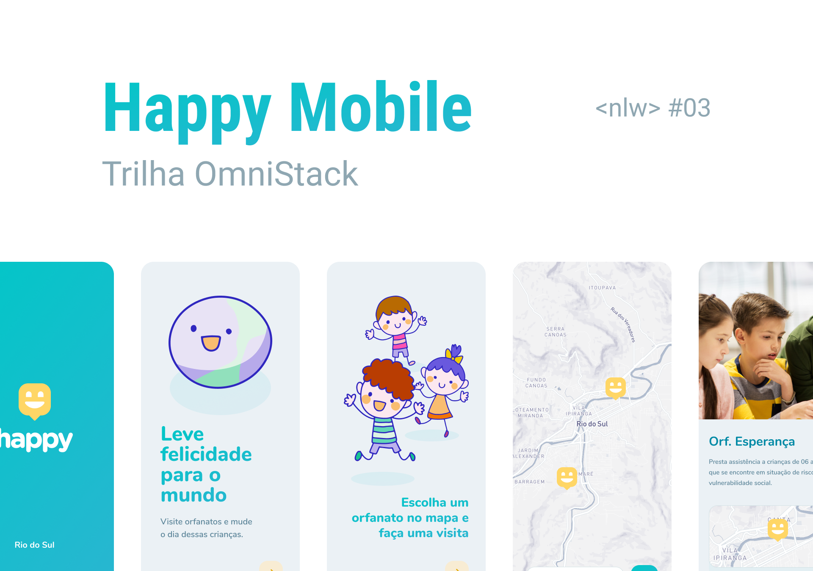

# Layout Web
<h1 align="center">
    
</h1>

# Layout Mobile
<h1 align="center">
    
</h1>

  

  

  

  

  

 
  

## 💻 Projeto

Happy - É uma plataforma onde você pode se conectar a orfanatos de sua cidade e proporcionar um momento inesquecível às crianças que precisam de algo tão importante: atenção!

Projeto desenvolvido durante a NLW - Next Level Week#03 oferecida pela [Rocketseat](https://rocketseat.com.br/).
